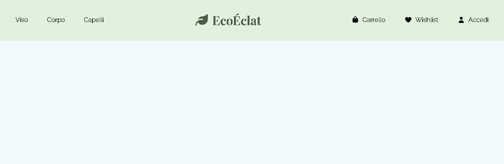
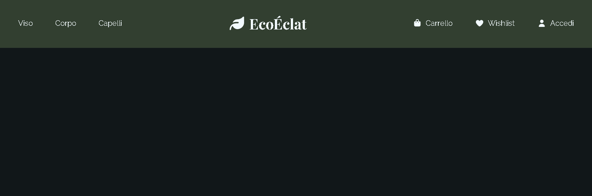
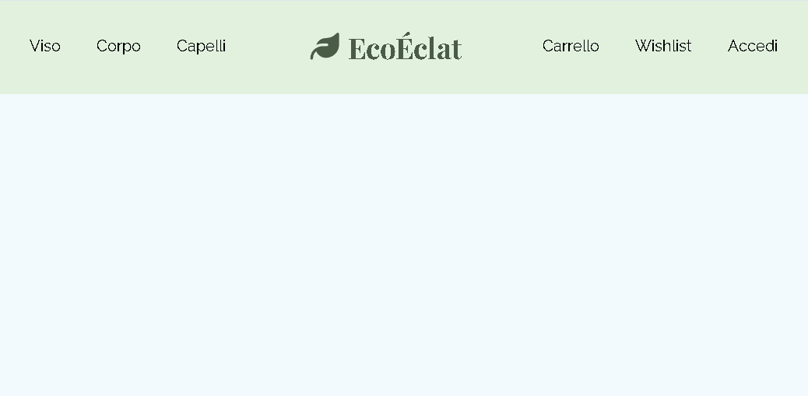
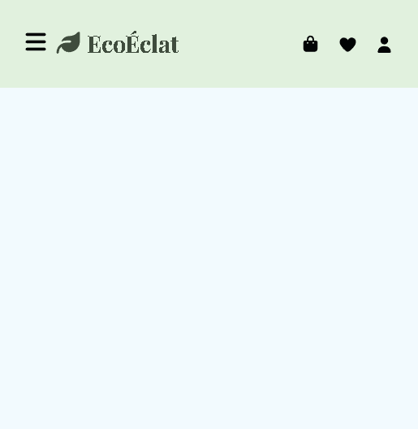

# 🌿 Header Custom per E-commerce Naturale

Un componente Header personalizzato sviluppato in **React + Storybook**, pensato per un e-commerce di cosmetici naturali.  
L’obiettivo: **UX ottimale, accessibilità, design responsivo** e **componenti riutilizzabili** secondo Atomic Design.

---

## 🔹 Panoramica

L’Header trasmette **calma, eleganza e naturalezza**, e include:

- **Logo centrale distintivo**
- **Navbar** con link principali e icone di utilità
- **Menu mobile a scomparsa** per navigazione ottimale

**Caratteristiche principali:**

| Funzionalità  | Descrizione                                           |
|---------------|-------------------------------------------------------|
| Logo          | Brand centrale, chiaro e riconoscibile               |
| Navbar        | Link principali e icone utente/carrello             |
| Menu Mobile   | Overlay verticale con hamburger menu                 |
| Responsività  | Desktop → menu orizzontale, Mobile → overlay verticale |
| Accessibilità | ARIA-label, focus-visible, contrasti WCAG AA        |

---

## ⚛️ Atomic Design

Struttura secondo Atomic Design:

### Atomi
- `Logo ` 
- `NavLink` (singoli link della navbar)
- `Icon` (carrello, wishlist, utente, hamburger menu)  

### Molecole
- `Navbar` → combinazione di link e icone  

### Organismi
- `Header` completo → logo + navbar + icone di utilità  

**Vantaggi:**
- ✅ Riutilizzabilità
- ✅ Coerenza visiva
- ✅ Facilità di manutenzione
- ✅ Scalabilità

---

## 🎨 Design & Identità Visiva

### Palette Colori 🌈

| Colore          | Scopo                         | Esempio CSS                 |
|-----------------|-------------------------------|-----------------------------|
| Verde Salvia    | Colore primario per elementi principali (sfondo, logo in modalità light)   | var(--color-green-0) → var(--color-green-10)       |
| Grigi Naturali  | Testi               | var(--color-gray-0) → var(--color-gray-15) |
| Viola Accento   | Stati hover/selected           | var(--color-purple-12) → var(--color-purple-2)     |

💡 La palette è scelta per **accessibilità e armonia visiva**, garantendo leggibilità su **light e dark mode**.

### Tipografia

| Elemento           | Font       | Scopo                        |
|-------------------|-----------|-------------------------------|
| Logo              | Serif     | Eleganza e riconoscibilità   |
| Navbar & Contenuti | Sans-serif | Leggibilità e modernità      |

### Modalità Light/Dark 🌗
- Variabili CSS `light-dark()` permettono transizione automatica tra light e dark mode  
- Tutti i componenti mantengono contrasto sufficiente

#### 🌞 Modalità light  



#### 🌙 Modalità dark  



---

## ♿ Accessibilità

- Contrasto colori ottimale per testi e sfondi  
- ARIA-label corretti (`<nav>`, `<ul>`, `<li>`)  
- Stati interattivi chiari: `default`, `hover`, `selected`, `focus`  
- Navigazione da tastiera supportata

---

## 📱 Responsività

- **Desktop:** menu orizzontale  
- **Tablet/Small Desktop:** riduzione testo icone e layout flessibile  
- **Mobile:** overlay verticale con hamburger menu  

> Nota UX: L’overlay mobile centra i link e permette interazioni facili con il pollice.

### 🖥️ Desktop  


### 📊 Tablet  



### 📱 Mobile  



---

## ✍️ UX Writing

- Testi chiari e brevi  
- Feedback visivo immediato  
- Icone con etichette ARIA per azioni comprensibili

---

## 📖 Storybook

- Documentazione interattiva dei componenti: Atoms, Molecules, Organisms  
- Varianti e stati: `default`, `selected`, `icon only`  
- Controlli dinamici: modifica testo, icone e layout in tempo reale  
- Sezioni dedicate a palette colori, tipografia, spacing

---

## 🛠 Tecnologie

- React + TypeScript  
- Storybook  
- FontAwesome  
- CSS custom properties & media queries  
- Atomic Design

---

## 🚀 Installazione

```bash
git clone https://github.com/giorgiameffe/webdesign-custom-header-storybook.git
cd webdesign-custom-header-storybook
npm install
npm run storybook
```
Apri Storybook per testare e modificare componenti in tempo reale.

---

## 🌟 Conclusioni

Questo progetto dimostra:

- Progettazione di componenti UI riutilizzabili e scalabili
- Cura di UX, accessibilità e design visivo
- Integrazione in design system aziendali